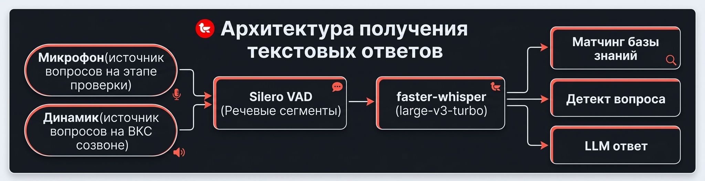

<p>
  
</p>

[](https://github.com/Mockingbird-go-on/mockingbird/actions/workflows/tests.yml)
[](https://www.python.org/downloads/release/python-3120/)
[](LICENSE)
[](https://t.me/MOCKINGBird_release)

💬 **Чат сообщества в Telegram: <https://t.me/MOCKINGBird_release>** —
вопросы, обсуждение релизов, помощь.

Десктопный ассистент для технических интервью: распознавание речи в реальном
времени и подсказки ответов из базы знаний и LLM. Аудио проходит через Silero
VAD → faster-whisper (large-v3-turbo, локально, CUDA с автоматическим
fallback на CPU), распознанные вопросы обрабатываются OpenAI-совместимым LLM
(по умолчанию DeepSeek).

**Приватность:** распознавание речи и база знаний полностью локальны — аудио
никуда не отправляется. Единственное, что уходит наружу, — **текст вопросов**
в ваш LLM API (настраиваемый `OPENAI_BASE_URL`); без заданного API-ключа
приложение работает как локальный транскрайбер без подсказок.

**Основная платформа: Windows (одиночный `.exe`).** Linux поддерживается из
исходников.

---

## Содержание

- [Демонстрация](#демонстрация)
- [Возможности](#возможности)
- [Архитектура](#архитектура)
- [Установка и запуск](#установка-и-запуск)
- [Конфигурация](#конфигурация)
- [Сборка Windows .exe](#сборка-windows-exe)
- [Тесты](#тесты)
- [Структура проекта](#структура-проекта)
- [Сообщество](#сообщество)
- [Лицензия](#лицензия)

## Демонстрация


> Живой транскрипт вопроса, ответ ИИ из базы знаний и LLM, история
> интервью — всё в реальном времени.

## Возможности

**Распознавание речи**

- faster-whisper (`large-v3-turbo`) на CUDA (авто-fallback на CPU) — локально.
- Инкрементальный чанк-декод: монолог 30–60 с распознаётся с лагом ~7 с.
- Спекулятивные partial-транскрипты в реальном времени, авто-финализация
  сегментов после паузы (~700 мс тишины).
- Пост-STT фонетическая коррекция терминов: «кубернетес» → Kubernetes,
  «Zabix» → Zabbix (bucket-индексированный матчер, ~0.4 мс на токен).
- Hot-words bias на уровне декодера whisper (`hotwords=` + initial prompt).

**Ассистент интервью**

- Ответы LLM стримятся в основную панель; типовой вопрос — ответ за ~5–6 с.
- База знаний (RAG-as-reference): блоки из KB — справочный контекст, отвечает
  всегда LLM. Загрузка PDF-резюме с генерацией тем через LLM.
- Глоссарий 400+ DevOps-терминов (EN+RU) с офлайн-объяснениями; неизвестные
  термины объясняет LLM с кэшированием в SQLite.
- Детект вопросов: явные маркеры, короткие implicit-вопросы («Prometheus.»),
  LLM-классификация длинных маркерлесс-финалов, склейка «расскажи про» +
  пауза + «Kubernetes».

**Захват аудио**

- Микрофон или loopback (системный звук / WASAPI) — для режима «Динамик».
- Адаптивный VAD RMS-порог: тихие источники не теряются.

**Надёжность и производительность**

- Watchdog для аудио-потока, auto-finalize при зависшем VAD, single-flight
  приоритет LLM-ответов над фоновыми вызовами.
- Warm start + CUDA warm-up: первый вопрос без 9-секундного штрафа.
- SQLite (`WAL`, `synchronous=NORMAL`): сессии, сегменты, кэш терминов.

## Архитектура



Вся тяжёлая работа (аудио, STT, LLM) — в worker-потоках; GUI получает только
ставящиеся в очередь Qt-сигналы.

## Установка и запуск

### Какую сборку скачать?

Со страницы [**Releases**](https://github.com/Mockingbird-go-on/mockingbird/releases)
возьмите файл по вашей ситуации:

| Ваша ситуация | Файл |
|---|---|
| **NVIDIA GPU** (или не уверены) | `Mockingbird-<ver>-windows-x64-cuda-setup.exe` — работает и на GPU, и на CPU (авто-fallback) |
| **Нет NVIDIA** / мало места / медленный интернет | `Mockingbird-<ver>-windows-x64-cpu-setup.exe` — лёгкая, только CPU |
| **Linux** | `Mockingbird-<ver>-linux-x86_64.AppImage` (или `.deb`) |
| **Машина без интернета** | инсталлятор **+** [пак модели](https://github.com/Mockingbird-go-on/mockingbird/releases/tag/models) (см. ниже) |

Модель whisper (~1.6 ГБ) скачивается при **первом запуске**. Если интернета
нет или прокси режет `huggingface.co` — скачайте `Mockingbird-whisper-*-model.zip`
(~1.55 ГБ) из релиза `models`, распакуйте так, чтобы папка `cache/` лежала
**рядом** с инсталлятором, и запустите установку: модель скопируется
автоматически. Пак подходит к обеим сборкам (CUDA и CPU).

### Установка из `.exe` (Windows, рекомендуется)

Запустите скачанный `Mockingbird-<ver>-windows-x64-*-setup.exe`. После установки
ярлык **Mockingbird** появится в меню «Пуск» и на рабочем столе.

> ⚠️ **Windows SmartScreen / «неопознанное приложение»**
>
> На сегодняшний день мы **не используем code-signing сертификат**.
> При первом запуске скачанного `Mockingbird-<ver>-windows-x64-*-setup.exe` Windows 10/11
> покажет экран:
>
> > «Фильтр SmartScreen в Microsoft Defender предотвратил запуск
> > неопознанного приложения, которое может подвергнуть компьютер риску».
>
> Это **нормально и безопасно**: SmartScreen не знает нашего издателя —
> он **не** нашёл вирус. Чтобы запустить установщик:
>
> 1. Нажмите **«Подробнее»** (мелкая ссылка слева в окне SmartScreen).
> 2. Нажмите появившуюся кнопку **«Выполнить в любом случае»**.
>
> Предупреждение появится **один раз** — после клика Windows запоминает
> решение для всех наших обновлений. Чтобы убрать его навсегда и ускорить
> репутацию — это нормальное поведение для неподписанных приложений.

### Запуск из исходников (для разработчиков)

Требуется Python 3.12.

```bash
python -m venv .venv
source .venv/bin/activate          # Windows: .venv\Scripts\activate
pip install -e ".[dev]"

mockingbird                        # запуск GUI
```

> Для Linux нужны системные библиотеки PortAudio:
> `sudo apt-get install libportaudio2`

Модель whisper скачивается в `~/.mockingbird/models` при первом запуске
(Silero VAD-модель вшита в пакет и доступна офлайн).

## Конфигурация

Настройки задаются переменными окружения (`.env`) или в GUI. Всё также настраивается в
диалоге «Настройки» (режим аудио mic/loopback, модель whisper, compute type,
beam, endpoint/ключ LLM, путь к глоссарию). Смена бэкенда/модели требует
перезапуска.

| Переменная | Назначение |
|---|---|
| `OPENAI_BASE_URL` / `OPENAI_API_KEY` / `OPENAI_MODEL` | OpenAI-совместимый LLM (ответы и объяснения терминов; глоссарий работает офлайн) |
| `MOCKINGBIRD_STT_BACKEND` | только `whisper` (значение `gigaam` из старых конфигов тихо мигрирует) |
| `MOCKINGBIRD_WHISPER_MODEL` | например `large-v3-turbo` |
| `MOCKINGBIRD_WHISPER_COMPUTE_TYPE` | `int8` / `int8_float32` / `float32` / `float16` (GTX 1070 / Pascal: `float32`; `int8_float32` ухудшает RU WER) |
| `MOCKINGBIRD_WHISPER_WINDOW_SECONDS` / `MOCKINGBIRD_WHISPER_PARTIAL_INTERVAL_MS` | ручки задержки |
| `MOCKINGBIRD_VAD_MIN_SILENCE_MS` / `MOCKINGBIRD_VAD_MIN_SPEECH_MS` | чувствительность VAD, финализация сегментов |
| `MOCKINGBIRD_TERMS_LLM_MIN_CHARS` | финалы короче (default 40) идут только в глоссарий, без LLM |

## Сборка Windows .exe

Из WSL, единая точка входа:

```bash
bash scripts/build.sh all               # все артефакты: win-gpu + win-cpu + linux + model-pack
bash scripts/build.sh win-gpu           # только CUDA-инсталлятор
bash scripts/build.sh win-cpu           # только CPU-инсталлятор
bash scripts/build.sh linux model-pack  # Linux + пак модели
bash scripts/build.sh win-gpu --clean   # полная пересборка без кэша PyInstaller
```

`build.sh` сам синкает проект на Windows-сторону, запускает сборку и
возвращает готовые инсталляторы в WSL `installer/`.

Собирается один exe: `mockingbird.exe` (оконный). Windows-цели дают
`installer/Mockingbird-<ver>-windows-x64-{cuda,cpu}-setup.exe`. Модель
whisper скачивается при первом запуске и в дистрибутив не включается (для
оффлайна — цель `model-pack`). Публикация релиза —
`bash scripts/build.sh publish` (см. [BUILD.md](BUILD.md) §6).

## Тесты

```bash
QT_QPA_PLATFORM=offscreen PYTHONPATH=src pytest -q              # non-Qt набор (568 тестов)
MOCKINGBIRD_TEST_WHISPER=1 pytest tests/test_whisper_engine.py  # интеграционные
```

Qt-зависимые тесты (жизненный цикл приложения, применение настроек) требуют
установленного PySide6.

## Структура проекта

```
src/mockingbird/
  audio/     захват аудио (mic/loopback WASAPI), Silero VAD, чанкер
  stt/       WhisperEngine (чанк-декод, спекулятивные partial'ы, CUDA-probe)
  kb/        индекс/матчер базы знаний, interview engine (очередь вопросов, LLM)
  terms/     глоссарий, фонетический матчер, кэш, объяснения терминов
  llm/       OpenAI-совместимый клиент (стриминг, single-flight gate)
  storage/   SQLite (сессии, сегменты, кэш терминов, настройки)
  ui/        главное окно, панель интервью, панель резюме, настройки, onboarding
```

## Сообщество

- 💬 **Telegram-чат**: [t.me/MOCKINGBird_release](https://t.me/MOCKINGBird_release) —
  вопросы, помощь, анонсы релизов.
- 🐛 [Баги и идеи](https://github.com/Mockingbird-go-on/mockingbird/issues) —
  формы «Сообщить о проблеме» / «Предложить идею».
- 💬 [Discussions](https://github.com/Mockingbird-go-on/mockingbird/discussions) —
  обсуждения, вопросы и ответы, show-and-tell.

## Лицензия

MIT — см. [LICENSE](LICENSE).
