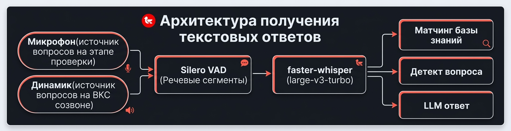

<p>
  
</p>

[](https://github.com/Mockingbird-go-on/mockingbird/actions/workflows/tests.yml)
[](https://www.python.org/downloads/release/python-3120/)
[](LICENSE)
[](https://t.me/MOCKINGBird_release)

💬 **Community chat on Telegram: <https://t.me/MOCKINGBird_release>** —
questions, release discussions, help.

> 🇷🇺 [README.md (Русский)](../README.md) · 🇬🇧 English · 🇪🇸 [README_ES.md (Español)](README_ES.md)

A desktop assistant for technical interviews: real-time speech recognition and
answer hints from a knowledge base and an LLM. Audio goes through Silero
VAD → faster-whisper (large-v3-turbo, locally, CUDA with automatic CPU
fallback); recognized questions are handled by an OpenAI-compatible LLM
(DeepSeek by default).

**Privacy:** speech recognition and the knowledge base are fully local —
audio never leaves your machine. The only thing sent out is the **text of the
questions** to your LLM API (configurable `OPENAI_BASE_URL`); without an API
key the app works as a local transcriber without hints.

**Primary platform: Windows (single `.exe`).** Linux is supported from
source.

---

## Table of Contents

- [Demo](#demo)
- [Features](#features)
- [Architecture](#architecture)
- [Install & Run](#install--run)
- [Configuration](#configuration)
- [Building the Windows .exe](#building-the-windows-exe)
- [Tests](#tests)
- [Project Structure](#project-structure)
- [Community](#community)
- [License](#license)

## Demo


> Live transcript of a question, an AI answer from the knowledge base and
> LLM, interview history — all in real time.

## Features

**Speech recognition**

- faster-whisper (`large-v3-turbo`) on CUDA (auto-fallback to CPU) — locally.
- Incremental chunk decoding: a 30–60 s monologue is transcribed with ~7 s lag.
- Speculative partial transcripts in real time, automatic segment
  finalization after a pause (~700 ms of silence).
- Post-STT phonetic term correction: "кубернетес" → Kubernetes,
  "Zabix" → Zabbix (bucket-indexed matcher, ~0.4 ms per token).
- Hot-words bias at the whisper decoder level (`hotwords=` + initial prompt).

**Interview assistant**

- LLM answers stream into the main panel; a typical question is answered in
  ~5–6 s.
- Knowledge base (RAG-as-reference): KB blocks serve as reference context,
  the LLM always answers. PDF resume upload with LLM-generated topics.
- Glossary of 400+ DevOps terms (EN+RU) with offline explanations; unknown
  terms are explained by the LLM with SQLite caching.
- Question detection: explicit markers, short implicit questions
  ("Prometheus."), LLM classification of long markerless finals, merging
  "tell me about" + pause + "Kubernetes".

**Audio capture**

- Microphone or loopback (system audio / WASAPI) — for the "Speaker" mode.
- Adaptive VAD RMS threshold: quiet sources are not lost.

**Reliability & performance**

- Watchdog for the audio stream, auto-finalize on a stalled VAD, single-flight
  priority of LLM answers over background calls.
- Warm start + CUDA warm-up: the first question without the 9-second penalty.
- SQLite (`WAL`, `synchronous=NORMAL`): sessions, segments, term cache.

## Architecture



All heavy work (audio, STT, LLM) runs in worker threads; the GUI only receives
queued Qt signals.

## Install & Run

### Which build should I download?

From the [**Releases**](https://github.com/Mockingbird-go-on/mockingbird/releases)
page pick the file for your situation:

| Your situation | File |
|---|---|
| **NVIDIA GPU** (or unsure) | `Mockingbird-<ver>-windows-x64-cuda-setup.exe` — works on both GPU and CPU (auto-fallback) |
| **No NVIDIA** / low disk space / slow internet | `Mockingbird-<ver>-windows-x64-cpu-setup.exe` — lightweight, CPU only |
| **Linux** | `Mockingbird-<ver>-linux-x86_64.AppImage` (or `.deb`) |
| **Offline machine** | installer **+** [model pack](https://github.com/Mockingbird-go-on/mockingbird/releases/tag/models) (see below) |

The whisper model (~1.6 GB) is downloaded on **first launch**. If you have no
internet or your proxy blocks `huggingface.co` — download
`Mockingbird-whisper-*-model.zip` (~1.55 GB) from the `models` release,
unpack it so that the `cache/` folder lies **next to** the installer, and run
the installation: the model will be copied automatically. The pack fits both
builds (CUDA and CPU).

### Installing from `.exe` (Windows, recommended)

Run the downloaded `Mockingbird-<ver>-windows-x64-*-setup.exe`. After
installation a **Mockingbird** shortcut appears in the Start Menu and on the
desktop.

> ⚠️ **Windows SmartScreen / "unrecognized app"**
>
> As of today we **do not use a code-signing certificate**.
> On the first launch of the downloaded
> `Mockingbird-<ver>-windows-x64-*-setup.exe` Windows 10/11 will show:
>
> > "Microsoft Defender SmartScreen prevented an unrecognized app from
> > starting. Running this app might put your PC at risk."
>
> This is **normal and safe**: SmartScreen doesn't know our publisher —
> it did **not** find a virus. To run the installer:
>
> 1. Click **"More info"** (the small link on the left in the SmartScreen
>    window).
> 2. Click the **"Run anyway"** button that appears.
>
> The warning appears **once** — after the click Windows remembers the
> decision for all our updates. This is normal behavior for unsigned apps.

### Running from source (for developers)

Python 3.12 is required.

```bash
python -m venv .venv
source .venv/bin/activate          # Windows: .venv\Scripts\activate
pip install -e ".[dev]"

mockingbird                        # launch the GUI
```

> On Linux you need the system PortAudio libraries:
> `sudo apt-get install libportaudio2`

The whisper model is downloaded to `~/.mockingbird/models` on first launch
(the Silero VAD model is bundled into the package and available offline).

## Configuration

Settings are defined via environment variables (`.env`) or in the GUI.
Everything is also configurable in the Settings dialog (mic/loopback audio
mode, whisper model, compute type, beam, LLM endpoint/key, glossary path).
Changing the backend/model requires a restart.

| Variable | Purpose |
|---|---|
| `OPENAI_BASE_URL` / `OPENAI_API_KEY` / `OPENAI_MODEL` | OpenAI-compatible LLM (answers and term explanations; the glossary works offline) |
| `MOCKINGBIRD_STT_BACKEND` | only `whisper` (the `gigaam` value from old configs is silently migrated) |
| `MOCKINGBIRD_WHISPER_MODEL` | e.g. `large-v3-turbo` |
| `MOCKINGBIRD_WHISPER_COMPUTE_TYPE` | `int8` / `int8_float32` / `float32` / `float16` (GTX 1070 / Pascal: `float32`; `int8_float32` degrades RU WER) |
| `MOCKINGBIRD_WHISPER_WINDOW_SECONDS` / `MOCKINGBIRD_WHISPER_PARTIAL_INTERVAL_MS` | latency knobs |
| `MOCKINGBIRD_VAD_MIN_SILENCE_MS` / `MOCKINGBIRD_VAD_MIN_SPEECH_MS` | VAD sensitivity, segment finalization |
| `MOCKINGBIRD_TERMS_LLM_MIN_CHARS` | finals shorter than (default 40) go to the glossary only, without the LLM |

## Building the Windows .exe

From WSL, single entry point:

```bash
bash scripts/build.sh all               # all artifacts: win-gpu + win-cpu + linux + model-pack
bash scripts/build.sh win-gpu           # CUDA installer only
bash scripts/build.sh win-cpu           # CPU installer only
bash scripts/build.sh linux model-pack  # Linux + model pack
bash scripts/build.sh win-gpu --clean   # full rebuild without the PyInstaller cache
```

`build.sh` syncs the project to the Windows side, runs the build and returns
the ready installers to WSL `installer/`.

A single exe is built: `mockingbird.exe` (windowed). Windows targets produce
`installer/Mockingbird-<ver>-windows-x64-{cuda,cpu}-setup.exe`. The whisper
model is downloaded on first launch and is not included in the distribution
(for offline use — the `model-pack` target). Release publishing —
`bash scripts/build.sh publish` (see [BUILD.md](../BUILD.md) §6).

## Tests

```bash
QT_QPA_PLATFORM=offscreen PYTHONPATH=src pytest -q              # non-Qt suite (568 tests)
MOCKINGBIRD_TEST_WHISPER=1 pytest tests/test_whisper_engine.py  # integration
```

Qt-dependent tests (app lifecycle, settings application) require PySide6
installed.

## Project Structure

```
src/mockingbird/
  audio/     audio capture (mic/WASAPI loopback), Silero VAD, chunker
  stt/       WhisperEngine (chunk decoding, speculative partials, CUDA probe)
  kb/        knowledge-base index/matcher, interview engine (question queue, LLM)
  terms/     glossary, phonetic matcher, cache, term explanations
  llm/       OpenAI-compatible client (streaming, single-flight gate)
  storage/   SQLite (sessions, segments, term cache, settings)
  ui/        main window, interview panel, resume panel, settings, onboarding
```

## Community

- 💬 **Telegram chat**: [t.me/MOCKINGBird_release](https://t.me/MOCKINGBird_release) —
  questions, help, release announcements.
- 🐛 [Bugs and ideas](https://github.com/Mockingbird-go-on/mockingbird/issues) —
  "Report a problem" / "Suggest an idea" forms.
- 💬 [Discussions](https://github.com/Mockingbird-go-on/mockingbird/discussions) —
  discussions, Q&A, show-and-tell.

## License

MIT — see [LICENSE](../LICENSE).
