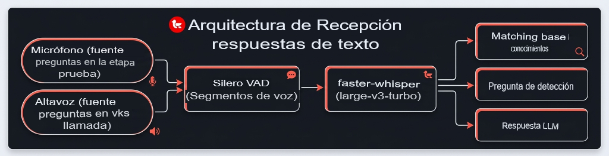

<p>
  
</p>

[](https://github.com/Mockingbird-go-on/mockingbird/actions/workflows/tests.yml)
[](https://www.python.org/downloads/release/python-3120/)
[](../LICENSE)
[](https://t.me/MOCKINGBird_release)
[](https://www.youtube.com/@Mockingbird-go-on)

> 🇷🇺 [README.md (Русский)](../README.md) · 🇬🇧 [README_EN.md (English)](README_EN.md) · 🇪🇸 Español

Un asistente de escritorio para entrevistas técnicas: reconocimiento de voz
en tiempo real y sugerencias de respuestas desde una base de conocimiento y
un LLM. El audio pasa por Silero VAD → faster-whisper (large-v3-turbo,
localmente, CUDA con fallback automático a CPU); las preguntas reconocidas
las procesa un LLM compatible con OpenAI (DeepSeek por defecto).

**Privacidad:** el reconocimiento de voz y la base de conocimiento son
completamente locales — el audio nunca sale de tu máquina. Lo único que se
envía al exterior es el **texto de las preguntas** (o una captura de pantalla
para screenshot-to-answer / modo «Test») a tu API de LLM (configurable con
`OPENAI_BASE_URL`); sin clave de API la aplicación funciona como transcriptor
local sin sugerencias.

**Plataformas: Windows — la principal (instalador `.exe`, variantes GPU/CPU).**
Linux — `AppImage` oficial en cada release; también se puede compilar desde
el código fuente.

### Requisitos de hardware

| Configuración | Mínimo | Cómodo |
|---|---|---|
| **CUDA (GPU NVIDIA)** | 4 GB VRAM, GTX 1050+ | 6+ GB VRAM (float32), respuesta en ~5–6 s |
| **CPU** | 8 GB RAM | 16 GB RAM (int8), respuesta en ~20–60 s por pregunta |
| Disco | ~3 GB (build CPU + modelo ~1.6 GB) | ~4 GB (build CUDA ~2.2 GB) |

---

## Índice

- [Demostración](#demostración)
- [Características](#características)
- [Arquitectura](#arquitectura)
- [Instalación y ejecución](#instalación-y-ejecución)
- [Configuración](#configuración)
- [FAQ](#faq)
- [Compilación del .exe para Windows](#compilación-del-exe-para-windows)
- [Pruebas](#pruebas)
- [Estructura del proyecto](#estructura-del-proyecto)
- [Comunidad](#comunidad)
- [Licencia](#licencia)

## Demostración


> Transcripción en vivo de una pregunta, respuesta de la IA desde la base de
> conocimiento y el LLM, historial de la entrevista — todo en tiempo real.

## Características

**Reconocimiento de voz**

- faster-whisper (`large-v3-turbo`) en CUDA (fallback automático a CPU) —
  localmente.
- Decodificación incremental por bloques: un monólogo de 30–60 s se
  transcribe con ~7 s de retraso.
- Transcripciones parciales especulativas en tiempo real, finalización
  automática de segmentos tras una pausa (~700 ms de silencio).
- Corrección fonética de términos post-STT: «кубернетес» → Kubernetes,
  «Zabix» → Zabbix (matcher con índice de buckets, ~0.4 ms por token).
- Sesgo de hot-words a nivel del decodificador whisper (`hotwords=` +
  initial prompt).

**Asistente de entrevistas**

- Las respuestas del LLM se transmiten al panel principal; una pregunta
  típica se responde en ~5–6 s.
- Base de conocimiento (RAG-as-reference): los bloques de la KB son contexto
  de referencia, siempre responde el LLM. Carga de CV en PDF con generación
  de temas mediante LLM.
- Glosario de más de 400 términos DevOps (EN+RU) con explicaciones offline;
  los términos desconocidos los explica el LLM con caché en SQLite.
- Detección de preguntas: marcadores explícitos, preguntas implícitas cortas
  («Prometheus.»), clasificación por LLM de finales largos sin marcadores,
  fusión de «hablame de» + pausa + «Kubernetes».

**Captura de pantalla a respuesta y modo «Test»**

- Ctrl+Shift+S o el botón 📷 → selecciona una región de pantalla → pregunta
  sobre la captura; la respuesta se transmite al panel «Respuesta de la IA»
  (requiere un LLM con capacidad de visión).
- Modo «Test»: vigila una ventana seleccionada (tu plataforma de tests),
  detecta cambios de tarea, muestra un overlay flotante «1 → B, 2 → D …»
  siempre visible.
- La compatibilidad de visión del LLM se comprueba al inicio; las capturas
  se guardan localmente en `~/.mockingbird/screenshots`.

**Diagnóstico**

- Ante un fallo — oferta de recopilar un archivo de registros
  (`mockingbird-diagnostics-*.zip`, claves API redactadas).
- El archivo de registro se escribe siempre; la pestaña «Log» es opcional
  (coste cero mientras está desactivada).

**Captura de audio**

- Micrófono o loopback (audio del sistema / WASAPI) — para el modo
  «Altavoz».
- Umbral RMS adaptativo del VAD: las fuentes tranquilas no se pierden.

**Fiabilidad y rendimiento**

- Watchdog para el flujo de audio, auto-finalización cuando el VAD se cuelga,
  prioridad single-flight de las respuestas del LLM sobre las llamadas en
  segundo plano.
- Warm start + calentamiento CUDA: la primera pregunta sin la penalización
  de 9 segundos.
- SQLite (`WAL`, `synchronous=NORMAL`): sesiones, segmentos, caché de
  términos.

## Arquitectura



Todo el trabajo pesado (audio, STT, LLM) se hace en hilos worker; la GUI solo
recibe señales Qt encoladas.

## Instalación y ejecución

### ¿Qué compilación descargar?

Desde la página de [**Releases**](https://github.com/Mockingbird-go-on/mockingbird/releases)
elige el archivo según tu situación:

| Tu situación | Archivo |
|---|---|
| **GPU NVIDIA** (o no estás seguro) | `Mockingbird-<ver>-windows-x64-cuda-setup.exe` — funciona tanto en GPU como en CPU (fallback automático) |
| **Sin NVIDIA** / poco espacio / internet lento | `Mockingbird-<ver>-windows-x64-cpu-setup.exe` — ligera, solo CPU |
| **Linux** | `Mockingbird-<ver>-linux-x86_64.AppImage` (o `.deb`) |
| **Máquina sin internet** | instalador **+** [paquete de modelo](https://github.com/Mockingbird-go-on/mockingbird/releases/tag/models) (ver abajo) |

El modelo de whisper (~1.6 GB) se descarga en el **primer inicio**. Si no
tienes internet o tu proxy bloquea `huggingface.co` — descarga
`Mockingbird-whisper-*-model.zip` (~1.55 GB) del release `models`, descomprímelo
de forma que la carpeta `cache/` quede **junto al** instalador, y ejecuta la
instalación: el modelo se copiará automáticamente. El paquete sirve para
ambas compilaciones (CUDA y CPU).

### Instalación desde `.exe` (Windows, recomendado)

Ejecuta el `Mockingbird-<ver>-windows-x64-*-setup.exe` descargado. Tras la
instalación, el acceso directo **Mockingbird** aparecerá en el menú Inicio y
en el escritorio.

> ⚠️ **Windows SmartScreen / «aplicación no reconocida»**
>
> A día de hoy **no usamos certificado de firma de código**.
> En el primer inicio del `Mockingbird-<ver>-windows-x64-*-setup.exe`
> descargado, Windows 10/11 mostrará:
>
> > «Microsoft Defender SmartScreen impidió que se iniciara una aplicación
> > no reconocida. Ejecutar esta aplicación podría poner en riesgo tu PC.»
>
> Esto es **normal y seguro**: SmartScreen no conoce nuestro editor —
> **no** ha encontrado ningún virus. Para ejecutar el instalador:
>
> 1. Haz clic en **«Más información»** (el enlace pequeño a la izquierda en
>    la ventana de SmartScreen).
> 2. Haz clic en el botón **«Ejecutar de todas formas»** que aparece.
>
> La advertencia aparece **una sola vez** — tras el clic, Windows recuerda la
> decisión para todas nuestras actualizaciones. Es el comportamiento normal
> para aplicaciones sin firma.

### Ejecución desde el código fuente (para desarrolladores)

Se requiere Python 3.12.

```bash
python -m venv .venv
source .venv/bin/activate          # Windows: .venv\Scripts\activate
pip install -e ".[dev]"

mockingbird                        # iniciar la GUI
```

> En Linux necesitas las bibliotecas de sistema de PortAudio:
> `sudo apt-get install libportaudio2`

El modelo de whisper se descarga en `~/.mockingbird/models` en el primer
inicio (el modelo Silero VAD viene incluido en el paquete y está disponible
offline).

## Configuración

Los ajustes se definen mediante variables de entorno (`.env`) o en la GUI.
Todo también es configurable en el diálogo «Ajustes» (modo de audio
mic/loopback, modelo de whisper, compute type, beam, endpoint/clave del LLM,
ruta del glosario). Cambiar el backend/modelo requiere reiniciar.

| Variable | Propósito |
|---|---|
| `OPENAI_BASE_URL` / `OPENAI_API_KEY` / `OPENAI_MODEL` | LLM compatible con OpenAI (respuestas y explicaciones de términos; el glosario funciona offline) |
| `MOCKINGBIRD_WHISPER_MODEL` | p. ej. `large-v3-turbo` |
| `MOCKINGBIRD_WHISPER_COMPUTE_TYPE` | `int8` / `int8_float32` / `float32` / `float16` (GTX 1070 / Pascal: `float32`; `int8_float32` empeora el WER de ruso) |
| `MOCKINGBIRD_WHISPER_WINDOW_SECONDS` / `MOCKINGBIRD_WHISPER_PARTIAL_INTERVAL_MS` | controles de latencia |
| `MOCKINGBIRD_VAD_MIN_SILENCE_MS` / `MOCKINGBIRD_VAD_MIN_SPEECH_MS` | sensibilidad del VAD, finalización de segmentos |
| `MOCKINGBIRD_TERMS_LLM_MIN_CHARS` | los finales más cortos que (por defecto 40) van solo al glosario, sin LLM |

## FAQ

**¿Dónde se instala la aplicación y dónde están mis datos?**
La aplicación se instala en Archivos de programa; todos los datos de usuario
(modelo, base SQLite, registros, capturas, ajustes) están en
`%USERPROFILE%\.mockingbird` (Linux: `~/.mockingbird`). El desinstalador
pregunta si eliminarlos.

**La descarga del modelo falla con error SSL / se queda al 0 %.**
Normalmente es un proxy corporativo o un antivirus con inspección SSL.
Excluye `huggingface.co`, `s3.cloud.ru` y `github.com` de la inspección, o
descarga el [paquete de modelo](https://github.com/Mockingbird-go-on/mockingbird/releases/tag/models)
manualmente y coloca `cache/` junto al instalador (ver arriba). El registro
contiene una pista ante fallos TLS.

**¿Funciona sin clave de LLM?**
Sí — como transcriptor local: se registran transcripciones e historial, sin
sugerencias. El glosario DevOps funciona offline.

**Mi LLM no soporta imágenes.**
Screenshot-to-answer y el modo «Test» requieren un modelo con capacidad de
visión (p. ej. `gpt-4o-mini`, `qwen-vl-*`). El botón 📷 se desactiva con una
pista; el asistente de voz sigue funcionando con normalidad.

## Compilación del .exe para Windows

Desde WSL, punto de entrada único:

```bash
bash scripts/build.sh all               # todos los artefactos: win-gpu + win-cpu + linux + model-pack
bash scripts/build.sh win-gpu           # solo instalador CUDA
bash scripts/build.sh win-cpu           # solo instalador CPU
bash scripts/build.sh linux model-pack  # Linux + paquete de modelo
bash scripts/build.sh win-gpu --clean   # recompilación completa sin caché de PyInstaller
```

`build.sh` sincroniza el proyecto al lado de Windows, ejecuta la compilación
y devuelve los instaladores listos a `installer/` en WSL.

Se compila un único exe: `mockingbird.exe` (con ventana). Los objetivos de
Windows producen `installer/Mockingbird-<ver>-windows-x64-{cuda,cpu}-setup.exe`.
El modelo de whisper se descarga en el primer inicio y no se incluye en la
distribución (para uso offline — el objetivo `model-pack`). Publicación de
releases — `bash scripts/build.sh publish` (ver [BUILD.md](../BUILD.md) §6).

## Pruebas

```bash
QT_QPA_PLATFORM=offscreen PYTHONPATH=src pytest -q              # suite sin Qt (1250+ pruebas)
MOCKINGBIRD_TEST_WHISPER=1 pytest tests/test_whisper_engine.py  # integración
```

Las pruebas dependientes de Qt (ciclo de vida de la app, aplicación de
ajustes) requieren PySide6 instalado.

## Estructura del proyecto

```
src/mockingbird/
  audio/     captura de audio (mic/loopback WASAPI), Silero VAD, chunker
  stt/       WhisperEngine (decodificación por bloques, parciales especulativos, probe CUDA)
  kb/        índice/matcher de la base de conocimiento, interview engine (cola de preguntas, LLM)
  terms/     glosario, matcher fonético, caché, explicaciones de términos
  llm/       cliente compatible con OpenAI (streaming, single-flight gate)
  storage/   SQLite (sesiones, segmentos, caché de términos, ajustes)
  ui/        ventana principal, panel de entrevista, panel de CV, ajustes, onboarding
```

## Comunidad

- 💬 **[Chat de Telegram](https://t.me/MOCKINGBird_release)** —
  preguntas, ayuda, anuncios de lanzamientos.
- 🐛 [Bugs e ideas](https://github.com/Mockingbird-go-on/mockingbird/issues) —
  formularios «Informar de un problema» / «Sugerir una idea».
- 💬 [Discussions](https://github.com/Mockingbird-go-on/mockingbird/discussions) —
  discusiones, preguntas y respuestas, show-and-tell.

## Licencia

MIT — ver [LICENSE](../LICENSE).
